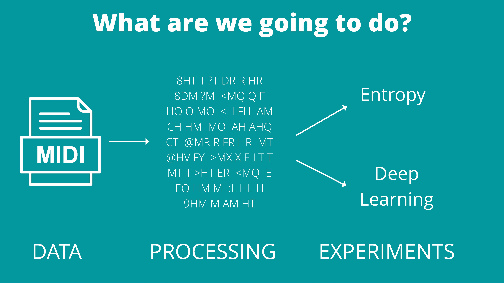
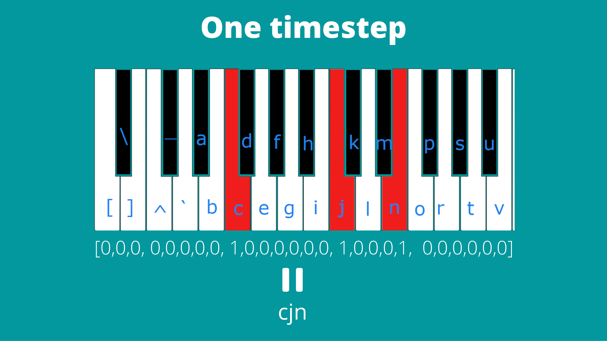
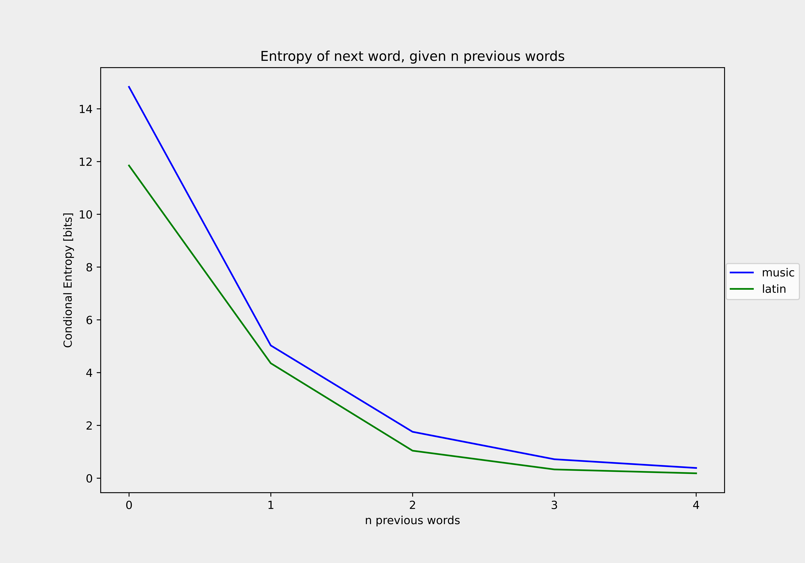
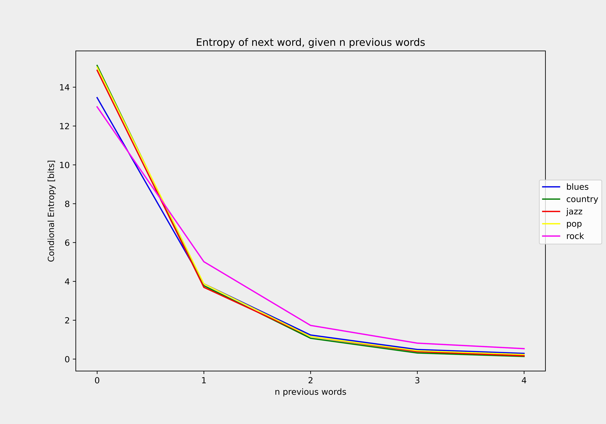
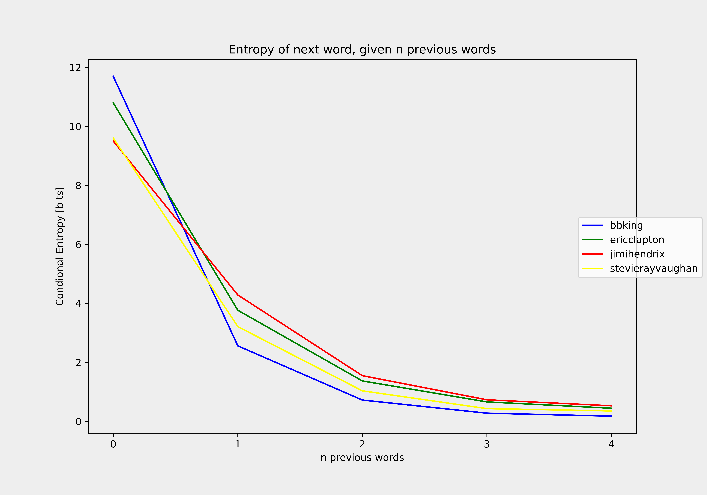
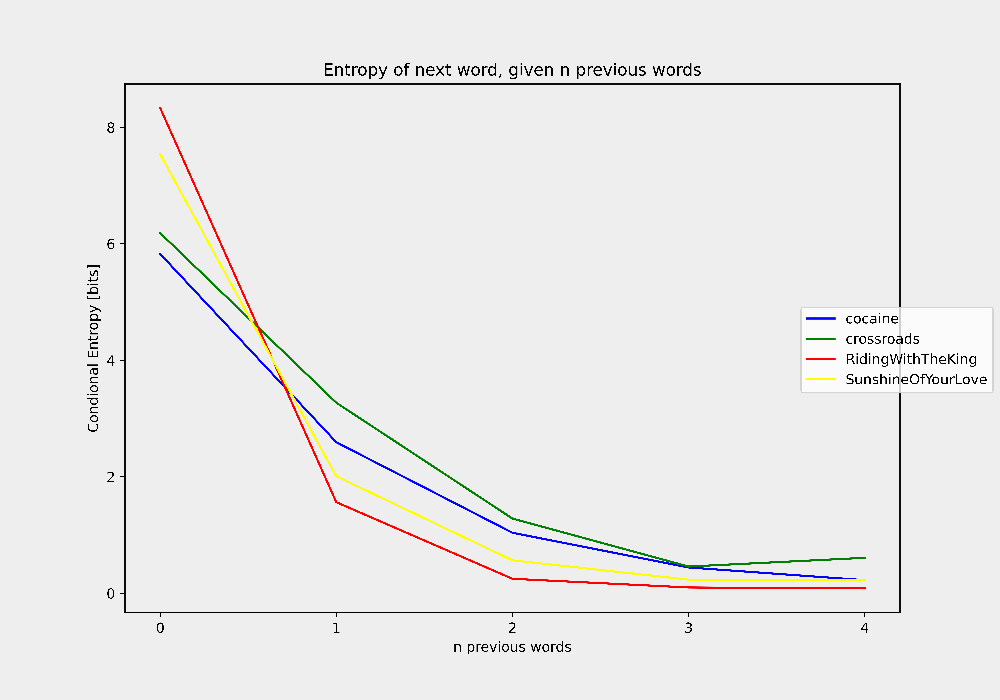

### Is music a natural language?
This repository is all about about comparing music to languages like latin and then trying to develop music generator using NLP techniques. Based on this project I've created a presentation that was presented during [GHOST Day: Applied Machine Learning Conference](https://ghostday.pl/)

Below you can find quick summary about what have been done. You can watch slides or dig into code for more details.

### What have been done
<p align="center">

</p>

##### Data gathering:
I really wanted to compare different genres and artist with one another. But unfortunatelly I couldn't find any good dataset comprising of midi songs with such classification. So I decided to create one by myself the ideal structure for me was:
```
└── genres /
    ├── rock/
    │   ├── artist_1/
    │   │   ├── song_1.mid
    │   │   └── song_2.mid
    │   └── artist_2/
    │       └── song_1.mid
    ├── jazz/
    │   └── artist_1
    ├── blues
    └── pop
```
So I've used technique called `Web scraping` to traverse pages with MIDI and download songs from here. One problem was that some artists had was labaled to many ganres and some labels I didn't like a lot. As a result I've filtered a lot of files and eventually end up with `8 thousand` songs. In the `scryper` folder you can see the scripts I've used.

If you are interested in getting the dataset please `contact me`. It is not that straightforward as a lot of the songs are copyrighted and due the law if we are speaking about generative models dataset can be used only for scientific purposes. Concerning discriminative models you can use the dataset for whatever you want. But I can't make it publicly available. [Click here for more information about law about using copyrighted datasets](https://arxiv.org/pdf/2105.09266.pdf)

#### Preprocessing
Since I wanted to compare music with languages I had to create common representation for them both. I decided to represent music as a text. You can find implementations of converters inside `midiToTxt`.
* In the first representation I've just mapped every possible piano key to one ASCII character and represent each timestep as a vector with characters (notes) to be played. 
<p align="center">
 
</p> 
Converted fragment of music may look like that. `R JR JR R :FR :FR AH AH <M <M M FM FM HQ HQ Q MQ MQ <HO <HO FM FM  5<AEM 5<AEM 5<AEM 5<AEM 5<AEM 5<AEM 5<AEM 5<AEM 5<AEM 5<AEM 5<AE 5<AE 5<AE 5<AE 5<AE`. You can see a lot of repetitions here, that's why I introduced compression.
    * lossy: `R JR R :FR AH  <M M FM HQ Q MQ  <HO FM  5<AEM 5<AE`. We just track changes and nothing more. It is usefull for calculating conditional entropy.
    * lossles: `R 1 JR 2 R 1 :FR 2 AH 2 <M 2 M 1 FM 2 HQ 2 Q 1 MQ 2 <HO 2 FM 2 5<AEM 10 5<AE 5`. Here I just count how many times given token repeated. During inference at each timestep we can try to predict the notes played and for how many times repeat them. This type of compression can shorten the original representation even 2 times.
* The second representation was more event based and it looks like that `n50 t4 n55 t1 n59 t2 w t2 n57 t2 w t2 n52 t4 n57 t4 n60 t4 w t4`. So `n50` means to play note 50 `t4` means to play the previous note for 4 units of time `n55 t1` to play note 55 for one unit of time and `w t2` means to stay idle for next 2 units of time. With this representation we limited amount of word to about `300` which is super cool.

#### Calculating entropy
Now we have data represented in a way we wanted so we can start our experiments. In the first one I compared how conditional entropy bahaves w.r.t music and latin language. In a nutshell conditional entropy `H(X|Y)` depicts our uncertaintity about event X knowing what happend in event Y. In our case Y - previous word we know that was spoken based on which we predict X - next word to be spoken. You can find more about conditional entropy in the slides. In general we expect that entropy to decrease w.r.t more words known. Here I present results which all shows that this musical text behaves very similarly to latin, and latin behaves very similarly to all other languages. You can find conditional entropy implementation in `entropy`
<p align="center">




</p>

#### Deep learning models
After seeing that this musical text behave like language I was more certain that typical NLP methods will be working. You can find all code considering this part in `notebooks`. At first 3 baselines was trained (All based on LSTM):
* first on that uncompressed representation, just using multilabel classification at each step. [Baseline 1 sample](/readme_data/baseline1.mp3)
* Second on lossles compression representation. At each step multilabel classification + Poisson regression. [Baseline 2 sample](/readme_data/baseline2.mp3)
* Third one on the event based representation. Dictonary of words was created and then after each step we perform typical classification. [Baseline 3 sample](/readme_data/baseline3.mp3)

I've got the most promising results from the third representation. That is why I used it to train GPT transformer, hoping for best results. [Transformer sample](/readme_data/transformer.mp3)

